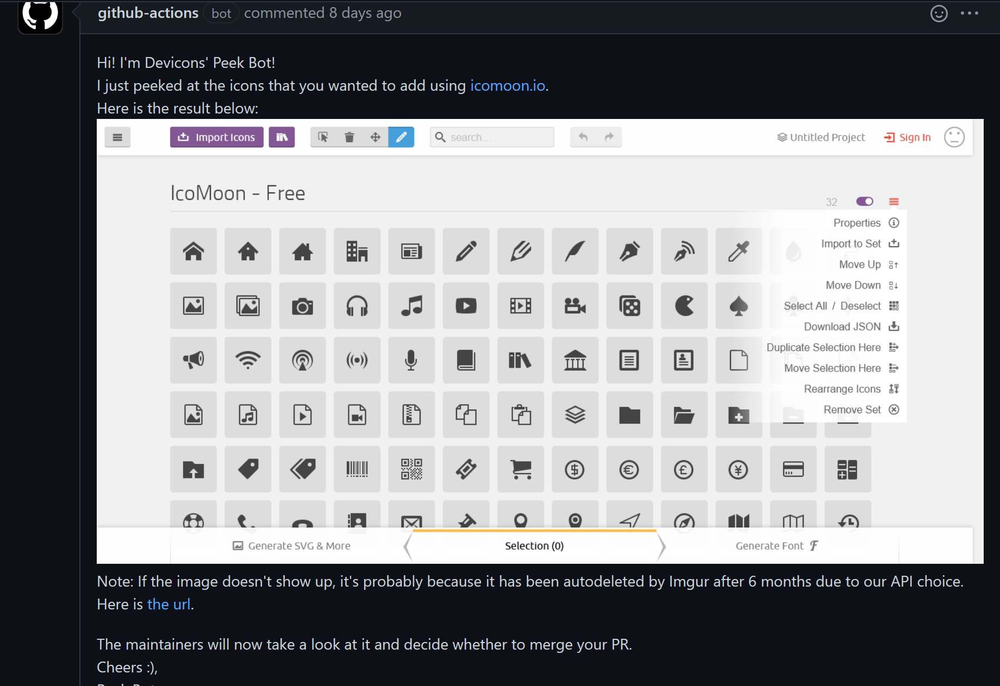

# public-upload-to-imgur
A GitHub Action that can upload "anonymous" images to Imgur using their API and give you the URL of the newly created image.
Note: "anonymous" means that the image is not tied to an account (see [this](https://apidocs.imgur.com/#intro)).

**Purpose** 
This action is used as part of the peek-icons workflow in the [devicon](https://github.com/devicons/devicon) repo to automate the
icon checking process. Our workflow would generate screenshots using Selenium, upload it to Imgur (using this action) then publish a comment on a PR showing the result (using [another action](https://github.com/marketplace/actions/pr-comment)).

## How To Use ##

**Prerequisite**
1. Sign up for an API client id (see [this](https://apidocs.imgur.com/#intro)).
  * Note: You do not need an OAuth token for this action.
2. Add the client id to the repo's secrets (see [this](https://docs.github.com/en/free-pro-team@latest/actions/reference/encrypted-secrets#in-this-article))


**Input**
```
path:
  description: 'Path to the images. Can be a single file path, folder or glob.'
  required: true
client_id:  
  description: 'The CLIENT_ID of your Imgur app'
  required: true
description:  
  description: 'A description for this set of images'
  default: "Images uploaded by public-upload-to-imgur GitHub Action"
  required: false
```


**Output**
```
  imgur_urls: 
    description: 'The urls to the images as a JSON.stringified array.'
    example: '["https://i.imgur.com/j1KnFp1.png", "https://i.imgur.com/UfhRqDR.png"]'
  markdown_urls:
    description: 'The urls to the images in GitHub image markdown formats as a JSON.stringified array.'
    example: '["", ""]'
```


**Upload a Picture Only**
```
steps:
  - name: Upload a picture
    uses: devicons/public-upload-to-imgur@v2.2.0  # Use this for the most stable version
    with:
      path: ./img.png  # required
      client_id: ${{secrets.IMGUR_CLIENT_ID}}  # required
      description: My picture  # optional
```

**Using the output after uploading one file**
```
steps:
  - name: Upload a picture
    uses: devicons/public-upload-to-imgur@v2.2.0
    id: imgur_step
    with:
      path: ./img.png 
      client_id: ${{secrets.IMGUR_CLIENT_ID}} 
    - name: Comment on the PR about the result
      uses: github-actions-up-and-running/pr-comment@v1.0.1  # you can use any action that you want. This is only an example
      env:
        # recall that this action returns a JSON.stringified array
        IMG_URL: ${{ fromJSON(steps.imgur_step.outputs.imgur_urls)[0] }}  # get the output of the step above using its id
        MESSAGE: |
          Here is the picture that was uploaded:
           # markdown syntax for displaying a picture
      with:
        repo-token: ${{ secrets.GITHUB_TOKEN }}
        message: ${{format(env.MESSAGE, env.IMG_URL)}}  # add the url into the string
```

**Upload Content of a Directory**
```
- uses: devicons/public-upload-to-imgur@v2.2.0
  with:
    path: path/to/images/ # or path/to/images
    client_id: ${{secrets.IMGUR_CLIENT_ID}} 
```


**Multiple Paths**
```
- uses: devicons/public-upload-to-imgur@v2.2.0
  with:
  path: |
      path/output/bin/
      path/output/test-results
      !path/**/*.tmp
```


**Wild Cards**
```
- uses: devicons/public-upload-to-imgur@v2.2.0
  with:
  path: path/**/[abc]rtifac?/*
```


**Real Life Examples**
Here's an usecase from our [devicon](https://github.com/devicons/devicon) repo:



You can also view the [example workflow](https://github.com/devicons/public-upload-to-imgur/blob/main/.github/workflows/demo.yml) and the [resulting action](https://github.com/devicons/public-upload-to-imgur/actions/runs/453537510) in this repo.

## Credits ##
The script for parsing multiple paths and glob inputs was taken from the [upload-artifacts](https://github.com/actions/upload-artifact/blob/main/src/search.ts) repo. 

Its conversion from TypeScript to JavaScript was done using [extendsclass.com](https://extendsclass.com/typescript-to-javascript.html)

The [API](https://apidocs.imgur.com/#intro) is provided by Imgur.
